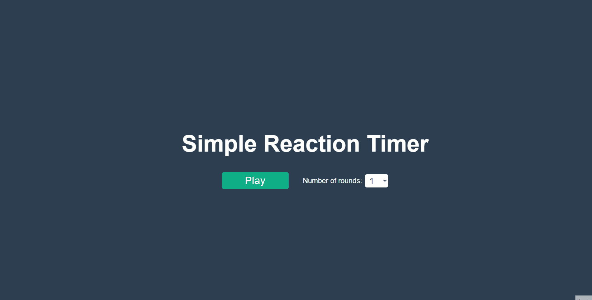

# Reaction Timer

A simple reaction timer game, built in Vue3. Features rounds and calculation of average reaction time in milliseconds and the end of selected number of rounds. Start of my journey to learn Vue.js

## Demo

Deployed at: "https://loving-goldberg-628e4e.netlify.app/"

## Features

- Multiple rounds
- Click target in random locations
- Calculate average reaction time in milliseconds

## Tech Stack

**Client:** Typescript, Vue, Vite
Deployed on Netlify.

## Lessons Learned

The basics of Vue, Options API vs. Composition API vs. Script Setup, props, emits, reactive(ref), directives, data binding
